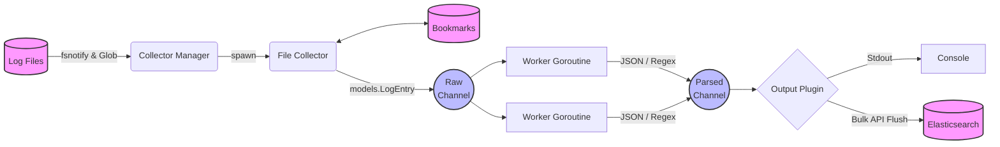

<div align="center">
  <h1>Log Aggregator 🪵</h1>
  <p>A fast, robust, and concurrent log shipping agent built in Go.</p>

  <!-- Badges -->
  <p>
    <a href="https://golang.org/doc/install"></a>
    <a href="https://github.com/elastic/go-elasticsearch"></a>
    <a href="https://opensource.org/licenses/MIT"></a>
  </p>
</div>

<br />

## 📖 Table of Contents
- [About the Project](#about-the-project)
- [System Architecture](#system-architecture)
- [Features](#features)
- [Getting Started](#getting-started)
  - [Prerequisites](#prerequisites)
  - [Installation](#installation)
- [Usage](#usage)
- [Configuration](#configuration)
- [Log Format](#log-format)
- [Contributing](#contributing)
- [License](#license)

---

## 🚀 About the Project

**Log Aggregator** is a lightweight, concurrent logging agent designed to continuously monitor local log files, intelligently parse structured JSON or plain-text logs, and reliably ship them to pluggable outputs (like Elasticsearch). Built entirely in Go, it features a minimal footprint while ensuring robust data guarantees (no partial log writes, state tracking to avoid duplicate reads, graceful shutdown mechanisms, and resilient network backoff logic).

This project aims to serve as a reliable drop-in sidecar container or host daemon for containerized microservices or bare-metal applications.

---

## 🏗️ System Architecture

The log aggregator uses a decoupled, channel-driven architecture to maintain high throughput and non-blocking reads.



### Components
1. **Collector Manager (`manager.go`, `file_collector.go`)**: Attaches an `fsnotify` watcher to the target files, supporting multiple glob patterns. Handles file rotation and EOF partial string buffering.
2. **State Tracker (`bookmark.go`)**: Keeps track of exactly how many bytes have been read from each file. If the aggregator crashes or restarts, it seamlessly resumes exactly where it left off, avoiding duplicate logs.
3. **Processor Pool (`pool.go`, `processor.go`)**: A dynamically scaled worker pool that ingests raw log strings, unmarshals the JSON data (or falls back to Regex parsing), and enriches it with time and context.
4. **Pluggable Output (`output.go`)**: Logs are sent to the configured destination. The **Elasticsearch Output** automatically retries transient failures with exponential backoff and jitter, while the **Stdout Output** provides easy local debugging.

---

## ✨ Features

- **Multi-File Tailing**: Monitor an unlimited number of files or directories concurrently via Glob pattern matching (e.g., `*.log`).
- **State Bookmarking**: Aggregator state is periodically flushed to a local `bookmarks.json` file. Reboots will not cause duplicate event ingestion.
- **Pluggable Outputs**: Ship logs to Elasticsearch or print them to stdout for local debugging.
- **Regex Parsing Fallback**: If a log line isn't valid JSON, the worker pool can dynamically parse plain text logs using named Regex capture groups.
- **Log Filtering**: Drop noisy logs before they ever reach the output:
  - **Severity Filtering**: Set a `min_level` (e.g., `INFO`) to automatically discard `DEBUG` logs. Unknown/unparseable levels are treated as severity `0` and dropped when a minimum is set.
  - **Drop Regexes**: Define regex patterns to silently discard logs matching specific strings (e.g., `healthcheck`, `metric_ping`).
- **Log Enrichment**: Inject static key-value labels (e.g., `environment`, `service`) into every log entry, with support for both **nested** and **flattened** output modes.
- **Graceful Shutdown**: Intercepts `SIGINT`/`SIGTERM` to coordinate a clean termination. Active pipelines are flushed to output, and bookmarks are saved ensuring zero dropped logs.
- **Robust Log Rotation**: Resilient to log rotation policies. Gracefully detects `Rename` and `Remove` events and reopens log files securely.

---

## 🛠️ Getting Started

### Prerequisites

* Go 1.20+
* (Optional) An active instance of Elasticsearch (v8.x or v9.x)

### Installation

Clone the repository and build the binary:

```bash
git clone https://github.com/Ketan-Chaudhary/log_aggregator.git
cd log_aggregator

# Download dependencies
go mod tidy

# Build the binary
go build -o log_aggregator cmd/main.go
```

---

## 💻 Usage

Start the agent by providing the path to your configuration file, or override settings using command-line flags.

```bash
# Run with a configuration file
./log_aggregator -config config.json

# Override settings with CLI flags
./log_aggregator -config config.json -workers 8 -file "/var/log/my_app.log"
```

To gracefully stop the agent, send a `SIGINT` (e.g. `Ctrl+C`). It will output:
```text
2026/06/09 02:12:34 Received termination signal, shutting down...
2026/06/09 02:12:35 Shutdown complete.
```

---

## ⚙️ Configuration

Settings are fully controlled via a `config.json` file. You can also override specific values using CLI flags.

### CLI Flags

| Flag | Description |
| :--- | :--- |
| `-config` | Path to the config file (defaults to `config.json`). |
| `-file` | Adds a local file path to monitor (appended to paths in `config.json`). |
| `-es` | A comma-separated list of Elasticsearch node URLs (overrides config). |
| `-workers` | The number of background goroutines to allocate (overrides config). |

### Full `config.json` Reference

```json
{
  "collector": {
    "paths": ["app.log", "/var/log/*.log"],
    "bookmark_file": "bookmarks.json"
  },
  "processor": {
    "workers": 4,
    "min_level": "INFO",
    "drop_regexes": [
      "healthcheck",
      "metric_ping"
    ],
    "labels": {
      "environment": "production",
      "service": "backend"
    },
    "label_mode": "flattened",
    "regex_patterns": [
      "(?P<timestamp>\\S+ \\S+) \\[(?P<level>[A-Z]+)\\] (?P<msg>.*)"
    ]
  },
  "output": {
    "type": "elasticsearch",
    "elasticsearch": {
      "urls": ["http://127.0.0.1:9200"],
      "index": "logs-index",
      "batch_size": 100,
      "flush_period_ms": 5000
    }
  }
}
```

### Config Options

#### `collector`

| Key | Type | Default | Description |
| :--- | :--- | :--- | :--- |
| `paths` | `string[]` | *required* | List of file paths or glob patterns to monitor (e.g., `"*.log"`, `"/var/log/app.log"`). |
| `bookmark_file` | `string` | `"bookmarks.json"` | Path to the file where read offsets are persisted. Used to resume after restarts. |

#### `processor`

| Key | Type | Default | Description |
| :--- | :--- | :--- | :--- |
| `workers` | `int` | `2` | Number of concurrent goroutines for parsing and filtering logs. |
| `min_level` | `string` | `""` (disabled) | Minimum log severity to keep. Logs below this level are dropped. Valid values: `DEBUG`, `INFO`, `WARN`, `ERROR`, `FATAL`. Case-insensitive. |
| `drop_regexes` | `string[]` | `[]` | List of regex patterns. If a raw log line matches any pattern, it is silently dropped before parsing. |
| `labels` | `object` | `{}` | Static key-value pairs injected into every log entry (e.g., `{"environment": "production"}`). |
| `label_mode` | `string` | `"nested"` | How labels appear in the output JSON. `"nested"` puts them under a `"labels"` key; `"flattened"` merges them into the root object. |
| `regex_patterns` | `string[]` | `[]` | Fallback regex patterns for parsing non-JSON log lines. Use named capture groups: `(?P<level>...)`, `(?P<timestamp>...)`, `(?P<request_id>...)`. |

#### `output`

| Key | Type | Default | Description |
| :--- | :--- | :--- | :--- |
| `type` | `string` | *required* | Output destination. Valid values: `"elasticsearch"`, `"stdout"`. |

#### `output.elasticsearch`

| Key | Type | Default | Description |
| :--- | :--- | :--- | :--- |
| `urls` | `string[]` | *required* | List of Elasticsearch node URLs. |
| `index` | `string` | *required* | The Elasticsearch index name to write logs to. |
| `batch_size` | `int` | `100` | Number of log entries to buffer before flushing a bulk request. |
| `flush_period_ms` | `int` | `5000` | Maximum time (in milliseconds) to wait before flushing a partial batch. |

### Processing Pipeline

The processor applies operations in this order to maximize CPU efficiency:

```
1. Raw Drop Regex  →  discard before any parsing
2. Parse / Extract →  JSON or Regex extraction
3. Severity Filter →  drop by log level
4. Enrichment      →  attach static labels
5. Output          →  send to destination
```

> **Note**: Enrichment happens *after* filtering to avoid allocating label maps for logs that will be discarded.

### Label Modes

**Nested** (`"label_mode": "nested"`):
```json
{
  "message": "user login",
  "labels": {
    "environment": "production",
    "service": "backend"
  }
}
```

**Flattened** (`"label_mode": "flattened"`):
```json
{
  "message": "user login",
  "environment": "production",
  "service": "backend"
}
```

> **Warning**: When using `"flattened"` mode, ensure your label keys do not conflict with built-in field names (`timestamp`, `level`, `message`, `source`, `request_id`).

---

## 📄 Log Format

The aggregator expects individual lines in the target file to be valid JSON strings, but it supports Regex Fallbacks.

### JSON Logs
By default, the internal processor (`models.LogEntry`) attempts to extract the following fields from JSON:

```json
{
  "level": "INFO",
  "msg": "user login successful",
  "request_id": "req-12345",
  "timestamp": "2023-10-27T10:00:00Z"
}
```

### Regex Logs
If the line is purely raw text (not valid JSON), the aggregator will attempt to apply the `regex_patterns` specified in the configuration. Use named capture groups (e.g., `(?P<level>INFO)`) to map matches to `level`, `request_id`, and `timestamp` fields.

* If a `timestamp` field is missing or invalid in both approaches, the aggregator will fallback to stamping the log with the current ingestion time.
* The original unparsed line is always safely preserved inside the `message` field.
* If the log level cannot be determined, it is treated as `UNKNOWN` (severity `0`). When `min_level` is set, unknown-level logs will be dropped.

---

## 🤝 Contributing

Contributions are what make the open-source community such an amazing place to learn, inspire, and create. Any contributions you make are **greatly appreciated**.

1. Fork the Project
2. Create your Feature Branch (`git checkout -b feature/AmazingFeature`)
3. Commit your Changes (`git commit -m 'Add some AmazingFeature'`)
4. Push to the Branch (`git push origin feature/AmazingFeature`)
5. Open a Pull Request

---

## 📜 License

Distributed under the MIT License. See `LICENSE` for more information.
