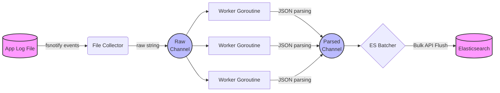

<div align="center">
  <h1>Log Aggregator 🪵</h1>
  <p>A fast, robust, and concurrent log shipping agent built in Go.</p>

  <!-- Badges -->
  <p>
    <a href="https://golang.org/doc/install"></a>
    <a href="https://github.com/elastic/go-elasticsearch"></a>
    <a href="https://opensource.org/licenses/MIT"></a>
  </p>
</div>

<br />

## 📖 Table of Contents
- [About the Project](#about-the-project)
- [System Architecture](#system-architecture)
- [Features](#features)
- [Getting Started](#getting-started)
  - [Prerequisites](#prerequisites)
  - [Installation](#installation)
- [Usage](#usage)
- [Configuration](#configuration)
- [Log Format](#log-format)
- [Contributing](#contributing)
- [License](#license)

---

## 🚀 About the Project

**Log Aggregator** is a lightweight, concurrent logging agent designed to continuously monitor local log files, intelligently parse structured JSON logs, and reliably ship them in bulk to an Elasticsearch cluster. Built entirely in Go, it features a minimal footprint while ensuring robust data guarantees (no partial log writes, graceful shutdown mechanisms, and resilient network backoff logic).

This project aims to serve as a reliable drop-in sidecar container or host daemon for containerized microservices or bare-metal applications.

---

## 🏗️ System Architecture

The log aggregator uses a decoupled, channel-driven architecture to maintain high throughput and non-blocking reads.



### Components
1. **Collector (`file_collector.go`)**: Attaches an `fsnotify` watcher to the target file. Handles EOF partial string buffering to prevent data corruption during rapid log flushing.
2. **Processor Pool (`pool.go`, `processor.go`)**: A dynamically scaled worker pool that ingests raw log strings, unmarshals the JSON data, and enriches it with time and context before sending it to the output.
3. **Elasticsearch Output (`elasticsearch.go`)**: Aggregates processed logs into configurable batch sizes. Automatically retries transient failures with exponential backoff and jitter.

---

## ✨ Features

- **Graceful Shutdown**: Intercepts `SIGINT`/`SIGTERM` to coordinate a clean termination. Active pipelines are flushed to Elasticsearch, ensuring zero dropped logs.
- **Robust Tailing**: Handles partial line writes safely without splitting JSON strings in half.
- **Auto-Discovery**: Validates the Elasticsearch connection with an early `.Ping()` on boot to fail-fast if configurations are incorrect.
- **Dynamic Workers**: Adjust the number of goroutines mapping/parsing JSON on the fly depending on CPU availability.
- **Bulk Operations**: Batches log requests to reduce HTTP overhead and maximize Elasticsearch indexing throughput.

---

## 🛠️ Getting Started

### Prerequisites

* Go 1.20+
* An active instance of Elasticsearch (v8.x or v9.x)

### Installation

Clone the repository and build the binary:

```bash
git clone https://github.com/Ketan-Chaudhary/log_aggregator.git
cd log_aggregator

# Download dependencies
go mod tidy

# Build the binary
go build -o log_aggregator cmd/main.go
```

---

## 💻 Usage

Start the agent by providing your log file path and Elasticsearch cluster URLs.

```bash
./log_aggregator -workers 4 -file "/var/log/my_app.log" -es "http://127.0.0.1:9200"
```

To gracefully stop the agent, send a `SIGINT` (e.g. `Ctrl+C`). It will output:
```text
2026/06/05 23:12:34 Received termination signal, shutting down...
2026/06/05 23:12:34 Shutdown complete.
```

---

## ⚙️ Configuration

Settings are controlled via command-line flags. 

| Flag | Default | Description |
| :--- | :--- | :--- |
| `-file` | `app.log` | The absolute or relative path to the local log file to monitor. |
| `-es` | `http://127.0.0.1:9200` | A comma-separated list of Elasticsearch node URLs. |
| `-workers` | `2` | The number of background goroutines to allocate for parsing JSON log strings. |

> **Note**: For massive log throughput, increasing `-workers` will improve JSON marshaling speed at the cost of CPU usage.

---

## 📄 Log Format

The aggregator expects individual lines in the target file to be valid JSON strings. By default, the internal processor (`models.LogEntry`) attempts to extract the following fields:

```json
{
  "level": "INFO",
  "msg": "user login successful",
  "request_id": "req-12345",
  "timestamp": "2023-10-27T10:00:00Z"
}
```

* If a `timestamp` field is missing or invalid, the aggregator will fallback to stamping the log with the current ingestion time.
* If the line is purely raw text (not valid JSON), the aggregator will wrap the line entirely inside the `message` field and forward it.

---

## 🤝 Contributing

Contributions are what make the open-source community such an amazing place to learn, inspire, and create. Any contributions you make are **greatly appreciated**.

1. Fork the Project
2. Create your Feature Branch (`git checkout -b feature/AmazingFeature`)
3. Commit your Changes (`git commit -m 'Add some AmazingFeature'`)
4. Push to the Branch (`git push origin feature/AmazingFeature`)
5. Open a Pull Request

---

## 📜 License

Distributed under the MIT License. See `LICENSE` for more information.
